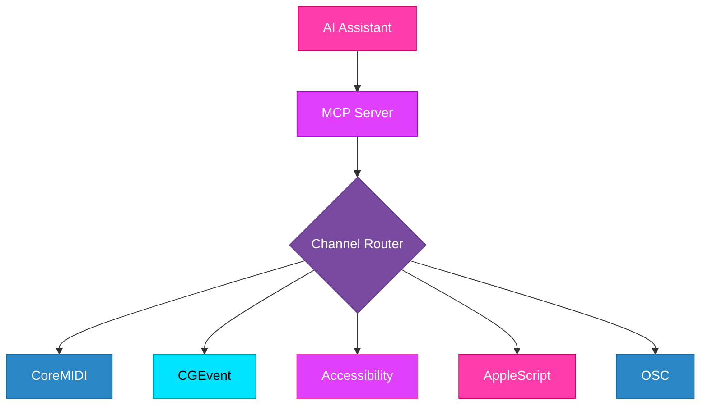

<p align="center">
  <picture>
    <source media="(prefers-color-scheme: dark)" srcset="docs/assets/header-dark.svg">
    <source media="(prefers-color-scheme: light)" srcset="docs/assets/header-light.svg">
    
  </picture>
</p>

<p align="center">
  <a href="LICENSE.md"></a>
  
  
  
</p>

---

> [!TIP]
> `claude mcp add logic-pro /path/to/LogicProMCP` — then restart Claude Code.

## The Problem

Logic Pro is a powerful DAW, but it has no API. Controlling it programmatically means navigating a maze of AppleScript limitations, accessibility APIs, MIDI Machine Control, and keyboard shortcuts — each with different capabilities and failure modes.

Logic Pro MCP gives AI assistants full control over Logic Pro through a single MCP interface, with automatic fallback across five communication channels.

## How It Works



The Channel Router picks the best channel for each operation and automatically falls back if one fails (circuit breaker pattern).

---

## Quick Start

```bash
# Clone and build
git clone https://github.com/qinnovates/logic-pro-mcp.git
cd logic-pro-mcp
swift build

# Register with Claude Code
claude mcp add logic-pro "$(pwd)/.build/debug/LogicProMCP"

# Restart Claude Code, then use it
```

> [!NOTE]
> Logic Pro must be running. You'll need to grant Accessibility and Automation permissions on first use — run `LogicProMCP --check-permissions` to verify.

---

## Tools

| Tool | Actions | Description |
|------|---------|-------------|
| **transport** | play, stop, record, pause, rewind, forward, set_bpm, set_position, toggle_cycle, toggle_metronome | Playback and recording control |
| **track** | create, delete, rename, select, mute, solo, arm | Track management |
| **mixer** | set_volume, set_pan, set_mute | Mixer channel control |
| **midi_send** | note, cc, program_change, pitch_bend | Send MIDI messages |
| **edit** | undo, redo, quantize, split, join, copy, paste, delete | Edit operations |
| **navigate** | goto_bar, goto_marker, create_marker, zoom_in, zoom_out, show_mixer, show_editor, show_automation | UI navigation |
| **project** | new, open, save, close, bounce | Project file operations |
| **system** | health, permissions | Diagnostics |

## Resources

| Resource | URI | Description |
|----------|-----|-------------|
| Transport State | `logicpro://state/transport` | Current playback state, tempo, position |
| Tracks | `logicpro://state/tracks` | All tracks with mute/solo/arm states |
| Mixer | `logicpro://state/mixer` | Mixer state per channel |
| Project | `logicpro://state/project` | Project metadata |
| Health | `logicpro://system/health` | Server health and channel status |

---

<details>
<summary><strong>Architecture</strong></summary>

### Channel Routing

Each operation domain has a prioritized fallback chain:

| Domain | Primary | Fallback 1 | Fallback 2 |
|--------|---------|------------|------------|
| transport | CoreMIDI | CGEvent | Accessibility |
| track | Accessibility | CGEvent | — |
| mixer | OSC | Accessibility | — |
| midi | CoreMIDI | — | — |
| edit | CGEvent | — | — |
| navigate | CGEvent | Accessibility | — |
| project | AppleScript | CGEvent | — |

The router uses a circuit breaker pattern — if a channel fails repeatedly, it's taken offline and retried after a cooldown.

### Source Layout

```
Sources/
├── LogicProMCP/              # Executable (entry point)
│   └── main.swift
└── LogicProMCPLib/           # Library (all logic)
    ├── Audio/                # FFT analysis, bounce control
    ├── Channels/             # 5 channel implementations + router
    ├── Config/               # Keybindings, server config
    ├── MIDI/                 # CoreMIDI engine, MMC commands
    ├── Permissions/          # macOS permission checks
    ├── Resources/            # MCP resource handlers
    ├── Server/               # MCP server + tool handlers
    └── State/                # Actor-based cache + poller
```

</details>

<details>
<summary><strong>Permissions</strong></summary>

Logic Pro MCP needs macOS permissions to control Logic Pro:

| Permission | Required For | How to Grant |
|------------|-------------|--------------|
| **Accessibility** | CGEvent key simulation, UI inspection | System Settings > Privacy & Security > Accessibility |
| **Automation** | AppleScript control of Logic Pro | Granted on first use (system prompt) |

Run `LogicProMCP --check-permissions` to verify all permissions are granted.

</details>

---

## Requirements

- macOS 14.0+
- Swift 6.0+
- Logic Pro (running)
- Claude Code or any MCP-compatible client

---

## Development

```bash
swift build          # Build
swift test           # Test
swift build -c release  # Release build
```

---

## License

[MIT](LICENSE.md)

---

<p align="center">Built by <a href="https://github.com/qinnovates">qinnovates</a></p>
